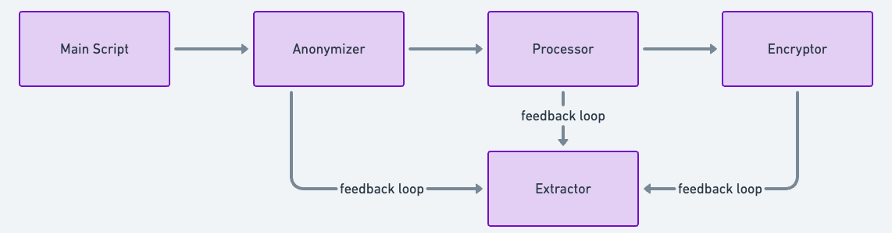

<meta http-equiv="refresh" content="0; url='https://mimbcd-ui.github.io/data-pipeline/web/index.html'" />

# Data Pipeline



[](https://github.com/MIMBCD-UI/data-pipeline/blob/master/LICENSE.md)
[](https://github.com/MIMBCD-UI/data-pipeline/commits/master)
[](#backers)
[](#sponsors)
[](https://gitter.im/opprTeam)
[](https://twitter.com/opprGroup)

This repository contains a data pipeline for processing medical imaging data. It includes modules for anonymizing DICOM files, encrypting patient IDs, extracting metadata, and processing the data. Additionally, the data pipeline offers flexibility and extensibility, allowing users to customize and expand its functionality according to specific project requirements. With a focus on scalability and performance optimization, the pipeline is capable of handling large volumes of medical imaging data efficiently. Its modular design fosters modularity and code reusability, promoting ease of maintenance and future enhancements.

Below are the key functionalities encapsulated within the pipeline:

1. **Anonymization Module**: This module is responsible for anonymizing DICOM files, ensuring the removal of sensitive patient-related information while adhering to regulatory compliance standards. It sanitizes the data by eliminating identifiable attributes, thereby safeguarding patient privacy.

2. **Encryption Module**: The encryption module adds an extra layer of security by encrypting patient IDs, thus enhancing data protection measures. By encrypting sensitive identifiers, the module ensures that patient information remains confidential and inaccessible to unauthorized parties.

3. **Metadata Extraction**: This module facilitates the extraction of metadata from DICOM files, enabling users to access valuable information embedded within the imaging data. It parses the DICOM headers to retrieve essential metadata attributes, providing insights into the imaging parameters and acquisition details.

4. **Data Processing**: The data processing module orchestrates the sequential execution of various operations, including preprocessing, analysis, and transformation of medical imaging data. It streamlines the processing pipeline, enabling seamless integration of diverse data processing tasks.

Encompassing these modules, the data pipeline provides a robust framework for effectively managing medical imaging data. Whether it involves anonymizing patient information, encrypting identifiers, extracting metadata, or processing imaging data, the pipeline offers a versatile solution tailored to meet the intricate [demands of medical and biomedical imaging](https://medium.com/oppr/medical-imaging-downloader-for-cornerstonejs-and-orthanc-d08c3a508d9b) workflows ([10.1007/s10278-021-00522-6](https://doi.org/10.1007/s10278-021-00522-6)). With its modular architecture, the pipeline facilitates seamless integration into existing healthcare systems and can be customized to accommodate specific use cases and requirements.

## Modules

- `anonymizer.py`: Module for anonymizing DICOM files by removing patient-related information and renaming them according to a specified format.
- `encryption.py`: Module for encrypting patient IDs.
- `extractor.py`: Module for extracting metadata from DICOM files.
- `main.py`: Main script for executing the data processing pipeline.
- `processor.py`: Module for processing medical imaging data.

## Usage

To use the data pipeline, follow these steps:

1. Clone the repository:

```bash
git clone https://github.com/MIMBCD-UI/data-pipeline.git
```

2. Install the required dependencies by creating a virtual environment and installing the packages listed in `requirements.txt`:

```bash
cd data-pipeline
pip install -r requirements.txt
```

3. Run the main script to execute the data processing pipeline:

```bash
python main.py
```

## DICOM Post-Processing Verification Pipeline

This section details the scripts involved in processing DICOM files within the MIMBCD-UI data pipeline. These scripts are responsible for handling various aspects of anonymization, metadata extraction, and file validation, ensuring the integrity and consistency of medical imaging data.

### Post-Processing Verification Workflow Overview

The following scripts should be executed in sequence as part of the data processing pipeline. Each script serves a specific purpose and contributes to the overall goal of maintaining high-quality, anonymized medical imaging data.

1. **`laterality.py` - Initial Metadata Extraction and File Preparation**
   - **Purpose:** This script processes DICOM files by converting anonymized patient IDs to their corresponding real patient IDs. It extracts critical metadata such as laterality (which side of the body the image represents) and renames/moves the files accordingly.
   - **When to Run:** Start with this script to organize and prepare the DICOM files before any further processing.
   - **Outcome:** The files are organized with accurate metadata, making them ready for comparison and validation.

2. **`compare.py` - Verification of Anonymized and Non-Anonymized File Correspondence**
   - **Purpose:** This script compares anonymized and non-anonymized DICOM files to ensure they match based on metadata like `InstanceNumber`, `ViewPosition`, and `ImageLaterality`. It also renames the files and moves them to a "checked" directory for further processing.
   - **When to Run:** Run this script after `laterality.py` to verify the correspondence between anonymized and non-anonymized files.
   - **Outcome:** Matched files are confirmed and organized in the "checked" directory.

3. **`checker.py` - File Comparison and Logging**
   - **Purpose:** This script provides an additional verification step by comparing anonymized and non-anonymized DICOM files based on `InstanceNumber`. It logs the paths of matching files to a CSV file for auditing and further analysis.
   - **When to Run:** Execute this script after `compare.py` to ensure a documented trail of matched files.
   - **Outcome:** A CSV file is generated, listing the paths of successfully matched files, ensuring traceability in the pipeline.

4. **`reanonimyzer.py` - Final Correction and Re-Anonymization**
   - **Purpose:** The final script in the sequence, `reanonimyzer.py`, corrects any discrepancies in the anonymized patient IDs and metadata based on predefined mappings. It updates the filenames and DICOM metadata as necessary and moves the corrected files to the final "checked" directory.
   - **When to Run:** This script should be run last, after `checker.py`, to finalize the anonymization and ensure data consistency.
   - **Outcome:** The DICOM files are fully re-anonymized, with all metadata and filenames accurately reflecting the correct anonymized patient IDs, ensuring they are ready for secure storage or further analysis.

### How to Run the Scripts

To execute the pipeline, follow the order outlined above:

```bash
# Step 1: Run laterality.py
python3 laterality.py

# Step 2: Run compare.py
python3 compare.py

# Step 3: Run checker.py
python3 checker.py

# Step 4: Run reanonimyzer.py
python3 reanonimyzer.py

## Contributing

Contributions are welcome! If you'd like to contribute to this project, please fork the repository and submit a pull request with your proposed changes.

## License

This project is licensed under the [MIT License](LICENSE).

### Team

Our team brings everything together sharing ideas and the same purpose, developing even better work. In this section, we will nominate the full list of important people for this repository, as well as respective links.

#### Authors

* Francisco Maria Calisto [ [Academic Website](https://web.tecnico.ulisboa.pt/francisco.calisto) | [ResearchGate](https://www.researchgate.net/profile/Francisco_Maria_Calisto) | [GitHub](https://github.com/FMCalisto) | [Twitter](https://twitter.com/FMCalisto) | [LinkedIn](https://www.linkedin.com/in/fmcalisto/) ]

* Diogo Araújo

* Carlos Santiago [ [ResearchGate](https://www.researchgate.net/profile/Carlos-Santiago-4) ]

* Catarina Barata

* Jacinto C. Nascimento [ [ResearchGate](https://www.researchgate.net/profile/Jacinto_Nascimento) ]

#### Promoters

* João Fernandes [ [ResearchGate](https://www.researchgate.net/profile/Joao-Fernandes-102) ]

* Margarida Morais [ [ResearchGate](https://www.researchgate.net/profile/Margarida_Morais2) ]

* João Maria Abrantes [ [ResearchGate](https://www.researchgate.net/profile/Joao-Abrantes-2) ]

* Nuno Nunes [ [ResearchGate](https://www.researchgate.net/profile/Nuno_Nunes2) ]

#### Companions

* Hugo Lencastre
* Nádia Mourão
* Miguel Bastos
* Pedro Diogo
* João Bernardo
* Madalena Pedreira
* Mauro Machado
* Bruno Dias
* Bruno Oliveira
* Luís Ribeiro Gomes

#### Acknowledgements

This work was partially supported by national funds by [FCT](http://fct.pt/) through both UID/EEA/50009/2013 and LARSyS - FCT Project 2022.04485.PTDC (MIA-BREAST) projects hosted by [IST](http://tecnico.ulisboa.pt/), as well as both BL89/2017-IST-ID and PD/BD/150629/2020 grants. We are indebted to those who gave their time and expertise to evaluate our work, who among others are giving us crucial information for the [BreastScreening](https://github.com/BreastScreening) project.

### Supporting

Our organization is a non-profit organization. However, we have many needs across our activity. From infrastructure to service needs, we need some time and contribution, as well as help, to support our team and projects.

<span>
  <a href="https://opencollective.com/oppr" target="_blank">
    
  </a>
</span>

#### Contributors

This project exists thanks to all the people who contribute. [[Contribute](CONTRIBUTING.md)].

<span class="image">
  <a href="graphs/contributors">
    
  </a>
</span>

#### Backers

Thank you to all our backers! 🙏 [[Become a backer](https://opencollective.com/oppr#backer)]

<span>
  <a href="https://opencollective.com/oppr#backers" target="_blank">
    
  </a>
</span>

#### Sponsors

Support this project by becoming a sponsor. Your logo will show up here with a link to your website. [[Become a sponsor](https://opencollective.com/oppr#sponsor)]

<span>
  <a href="https://opencollective.com/oppr/sponsor/0/website" target="_blank">
    
  </a>
</span>

<br />

<span>
  <a href="http://www.fct.pt/" title="FCT" target="_blank">
    
  </a>
</span>
<span>
  <a href="https://www.fccn.pt/en/" title="FCCN" target="_blank">
    
  </a>
</span>
<span>
  <a href="https://www.ulisboa.pt/en/" title="ULisboa" target="_blank">
    
  </a>
</span>
<span>
  <a href="http://tecnico.ulisboa.pt/" title="IST" target="_blank">
    
  </a>
</span>
<span>
  <a href="http://hff.min-saude.pt/" title="HFF" target="_blank">
    
  </a>
</span>
<span>
  <a href="https://www.chtmad.min-saude.pt/" title="CHTMAD" target="_blank">
    
  </a>
</span>

##### Departments

<span>
  <a href="http://dei.tecnico.ulisboa.pt" title="DEI" target="_blank">
    
  </a>
</span>
<span>
  <a href="http://deec.tecnico.ulisboa.pt" title="DEEC" target="_blank">
    
  </a>
</span>

##### Laboratories

<span>
  <a href="http://sipg.isr.tecnico.ulisboa.pt/" title="SIPG" target="_blank">
    
  </a>
</span>
<span>
  <a href="http://welcome.isr.tecnico.ulisboa.pt/" title="ISR" target="_blank">
    
  </a>
</span>
<span>
  <a href="http://larsys.pt/" title="LARSys" target="_blank">
    
  </a>
</span>
<span>
  <a href="https://iti.larsys.pt/" title="ITI" target="_blank">
    
  </a>
</span>
<span>
  <a href="http://www.inesc-id.pt/" title="INESC-ID" target="_blank">
    
  </a>
</span>

##### Domain

<span>
  <a href="https://europa.eu/" title="EU" target="_blank">
    
  </a>
</span>
<span>
  <a href="https://www.portugal.gov.pt/" title="Portugal" target="_blank">
    
  </a>
</span>